# Control & Data Plane Resiliency for OpenPERouter

## Summary

OpenPERouter currently ties its data plane lifecycle to the FRR container
lifecycle. When the router pod dies, Kubernetes destroys its network namespace,
tearing down all VXLAN tunnels, VRFs, bridges, veth endpoints, the underlay
NIC, and the VTEP loopback. The kernel could keep forwarding packets with its
existing FDB and routing entries, but the ephemeral netns wipes everything.

This enhancement proposes decoupling the data plane from the FRR container by
running the router inside a **persistent named network namespace**. The netns
is held open by a bind mount, independent of any container or process lifetime.
Traffic continues flowing when the router container crashes or restarts, and
the control plane recovers within seconds via BGP Graceful Restart.

## Motivation

### Goals

- **Zero data plane disruption** on FRR process crash or restart: the kernel
  continues forwarding packets using existing routes and FDB entries while FRR
  recovers.
- **Fast control plane recovery** (~7-22 seconds): FRR re-enters the existing
  network namespace, finds all interfaces intact, and re-establishes BGP
  sessions using Graceful Restart.
- **Simplified controller logic**: the controller targets a well-known netns
  path (`/var/run/netns/perouter`) instead of discovering a pod's netns via CRI
  queries or PID file parsing.
- **Decoupled interface provisioning**: the controller can pre-configure
  interfaces before FRR starts, rather than waiting for pod readiness.

### Non-Goals

- Protection against full node (kernel) failure. Per-node resilience only
  addresses FRR process-level failures; node-level failures are handled at the
  fabric/cluster layer.
- Hitless upgrades in a single-instance deployment. Rolling upgrades without
  traffic loss require redundant instances (see
  [Alternatives](#alternatives)).
- Changes to workload pod networking. Multus-attached secondary interfaces on
  application pods and KubeVirt VMs are unaffected by this proposal.

## Proposal

### Overview

Replace the ephemeral pod-owned network namespace with a **persistent named
network namespace** (`/var/run/netns/perouter`) created at boot and held open
by a bind mount. The FRR process runs inside this namespace; when FRR dies, the
bind-mounted namespace persists, keeping all kernel networking state alive —
VRFs, bridges, VXLANs, routes, FDB entries, and the underlay NIC all survive.

### Router pod deployment model
The persistent named netns is the **core idea** of this proposal. It is
orthogonal to how the FRR container is deployed, which can be in any of the
following alternatives:

- **Podman quadlet**: a systemd oneshot creates the netns; the FRR container
  joins it via `Network=ns:/var/run/netns/perouter`. Systemd manages the
  lifecycle.
- **Kubernetes hostNetwork pod**: a privileged pod (e.g. the `controller`)
  creates the named netns; the FRR container uses `nsenter` to run inside it.
  The pod runs with `hostNetwork: true` but FRR itself operates in the named
  netns.
The deployment model affects how the container is managed and restarted, but
the resilience properties — persistent data plane, BGP Graceful Restart
bridging the control plane gap — are the same in all cases.

### Architecture

```
┌─────────────────────────────────────────────────────────────────┐
│                        K8s Node (Host)                          │
│                                                                 │
│  ┌──────────────────────────────────────┐                       │
│  │  Named Netns: /var/run/netns/perouter│  ◄── persists across  │
│  │  (created by the controller)         │      container death  │
│  │                                      │                       │
│  │  ┌─────────┐  ┌──────────┐           │                       │
│  │  │ lound   │  │ eth1     │           │                       │
│  │  │ (VTEP)  │  │(underlay)│           │                       │
│  │  └─────────┘  └──────────┘           │                       │
│  │                                      │                       │
│  │  ┌─────────────────────────────┐     │                       │
│  │  │ vrf100                      │     │                       │
│  │  │  ├─ br100 ─── vxlan100      │     │                       │
│  │  │  └─ pe0 (veth) ─────────────┼──┐  │                       │
│  │  └─────────────────────────────┘  │  │                       │
│  │                                   │  │                       │
│  │  FRR processes (come and go)      │  │                       │
│  │   bgpd, zebra, bfdd, staticd      │  │                       │
│  │  reloader process (come and go)   │  │                       │
│  └───────────────────────────────────┼──┘                       │
│                                      │                          │
│  Host Network Namespace              │                          │
│  ┌───────────────────────────────────┼─────────────────┐        │
│  │  host0 (veth) ◄───────────────────┘                 │        │
│  │    ↕ BGP session (frr-k8s / Calico / Cilium)        │        │
│  │                                                     │        │
│  │  br-hs-{vni} (host bridges for L2VNI)               │        │
│  │  eth0 / CNI interfaces (K8s pod networking)         │        │
│  └─────────────────────────────────────────────────────┘        │
│                                                                 │
│  Components:                                                    │
│  ├─ Controller (K8s DaemonSet)                                  │
│  │    creates netns, provisions interfaces, manages FRR config  │
│  └─ FRR + Reloader (Quadlet or hostNetwork Pod)                 │
│       joins named netns, runs routing daemons                   │
│                                                                 │
│  K8s Workload Pods (unchanged):                                 │
│  ├─ Pod A ── eth0 (CNI) + net1 (Multus macvlan → br-hs-100)     │
│  └─ Pod B ── eth0 (CNI) + net1 (Multus macvlan → br-hs-200)     │
└─────────────────────────────────────────────────────────────────┘
```

### User Stories

#### Story 1: FRR Process Crash

As a cluster operator, I want traffic to continue flowing when the FRR process
crashes, so that workloads experience zero data plane disruption while the
control plane recovers automatically within seconds.

#### Story 2: Router Software Upgrade

As a cluster operator, I want to upgrade the OpenPERouter bits (controller,
router, etc) for a version upgrade without tearing down VXLAN tunnels or VRFs,
so that existing traffic flows are not interrupted during the upgrade.

### Risks and Mitigations

| Risk | Mitigation |
|------|------------|
| Named netns is not cleaned up on node shutdown | `/var/run` is a tmpfs, so the bind mount is automatically removed on reboot. The controller can also explicitly delete the netns during graceful shutdown. |
| FRR restarts too quickly before interfaces are ready | Interfaces persist in the named netns; FRR always finds them ready |
| BGP Graceful Restart not supported by all peers | GR is widely supported (FRR, BIRD, Cisco, Arista); document peer requirements |
| Router netns drifts out of sync with desired config (controller bug, partial failure, manual interference) | The system is designed for full netns teardown and rebuild: `ip netns delete perouter` followed by a restart of the router process deterministically recreates a correct state. The controller detects the missing netns, recreates it, and re-provisions all interfaces from CRD state. See [Recovery from a Deleted or Emptied Namespace](#recovery-from-a-deleted-or-emptied-namespace). |

## Design Details

### Named Netns Lifecycle

The controller pod is responsible for creating and managing the well-known
network namespace (`/var/run/netns/perouter`). This is a natural fit because
the controller already provisions all interfaces inside the netns — it simply
adds namespace creation as the first step in its reconciliation loop.

On startup, the controller checks whether `/var/run/netns/perouter` exists. If
not, it creates it, and sets a bind mount that holds the netns open
independently of any process. It persists until explicitly deleted or the node
reboots (since `/var/run` is a tmpfs).

Having the controller own the netns lifecycle has several advantages:

- **Single owner**: the same component that creates interfaces inside the netns
  also creates the netns itself. There is no ordering dependency on a separate
  systemd unit.
- **Works in all deployment models**: whether the controller runs as a K8s
  DaemonSet or a Podman quadlet, it creates the netns the same way. No
  host-level systemd units are required.
- **Idempotent**: `EnsureNamespace` is safe to call on every reconciliation
  loop — it is a no-op if the netns already exists.
- **Recovery-aware**: after a namespace deletion (manual or via
  `HandleNonRecoverableError`), the controller detects the missing netns on its
  next reconciliation and recreates it automatically.

### Controller Netns Discovery

The `RouterProvider` interface
(`internal/controller/routerconfiguration/router.go`) already abstracts netns
discovery. A new `RouterNamedNSProvider` would return the well-known path.

### Decoupled Lifecycle Sequence

With a named netns, the controller can create the namespace and pre-configure
interfaces which FRR will use.

1. **Controller starts** - creates the named netns via `EnsureNamespace()`,
   then configures interfaces in it (VRFs, bridges, VXLANs, veths, underlay
   NIC)
2. **FRR starts** - attempts to enter the netns. If the controller has not yet
   created it, the router will repeatedly crash until the netns is ready. Once
   available, FRR enters the netns, finds everything already set up, and starts
   routing

The following sequence diagrams illustrate how the controller, FRR, and the
BGP peers interact across the three key lifecycle scenarios.

#### Initial Boot Sequence

```mermaid
sequenceDiagram
    autonumber
    participant netns as Named Netns<br/>/var/run/netns/perouter
    participant ctrl as Controller<br/>(K8s DaemonSet)
    participant k8s as K8s API
    participant reloader as Reloader<br/>(routerpod)
    participant frr as FRR<br/>(routerpod)
    participant tor as ToR Switch<br/>(BGP Peer)
    participant hostBGP as Host BGP Speaker<br/>(frr-k8s / Calico)

    Note over ctrl: Node boots, K8s schedules<br/>controller DaemonSet pod

    rect rgb(20, 40, 70)
        Note right of ctrl: Phase 1: Controller Creates Named Netns
        activate ctrl
        ctrl->>k8s: List Underlay, L3VNI, L2VNI,<br/>L3Passthrough CRDs
        k8s-->>ctrl: CRD specs (filtered by node selector)

        ctrl->>netns: EnsureNamespace():<br/>Create netns + bind mount
        activate netns
        Note over netns: Bind mount created at<br/>/var/run/netns/perouter<br/>Persists independently of any process
    end

    rect rgb(20, 55, 35)
        Note right of ctrl: Phase 2: Controller Provisions Interfaces
        Note over ctrl,netns: Pre-configure interfaces before FRR starts

        ctrl->>netns: SetupUnderlay()<br/>Move physical NIC (eth1) into netns
        ctrl->>netns: Create lound dummy interface<br/>Assign VTEP IP (e.g. 100.65.0.X/32)
        ctrl->>netns: SetupL3VNI() for each L3VNI:<br/>Create VRF, bridge, VXLAN,<br/>veth pair (pe-side in netns, host-side in host)
        ctrl->>netns: SetupL2VNI() for each L2VNI:<br/>Create VRF, bridge, VXLAN,<br/>veth pair, host-side bridge (br-hs-{vni})
        ctrl->>netns: SetupPassthrough() if configured:<br/>Create veth pair for host BGP connectivity

        Note over ctrl: All interfaces ready in netns<br/>before FRR starts
    end

    rect rgb(70, 45, 15)
        Note right of frr: Phase 3: FRR + Reloader Start
        Note over frr: Router pod may have been crash-looping<br/>waiting for netns to appear — now succeeds
        frr->>netns: Enter named netns<br/>(Network=ns: or nsenter)
        activate frr
        Note over frr: FRR finds all interfaces<br/>already configured by controller

        activate reloader
        reloader-->>reloader: Listen on Unix socket<br/>/etc/perouter/frr.socket<br/>Health endpoint :9080/healthz
    end

    rect rgb(55, 25, 60)
        Note right of ctrl: Phase 4: FRR Configuration & BGP Sessions
        ctrl->>ctrl: APItoFRR(): generate FRR config<br/>from CRD specs + nodeIndex<br/>New netns → omit preserve-fw-state
        ctrl->>reloader: POST config via Unix socket<br/>/etc/perouter/frr.socket
        reloader->>reloader: frr-reload.py --test (validate)
        reloader->>frr: frr-reload.py --reload (apply)
        reloader-->>ctrl: HTTP 200 OK

        frr->>frr: zebra discovers existing interfaces<br/>(VRFs, bridges, VXLANs, veths, lound)
        frr->>tor: BGP OPEN (underlay session)<br/>ASN 64514, capabilities: EVPN, GR
        tor-->>frr: BGP OPEN (accept)
        frr->>tor: EVPN Type-5 routes (L3VNI prefixes)<br/>EVPN Type-2 routes (MAC/IP for L2VNI)
        tor-->>frr: EVPN routes from fabric

        frr->>hostBGP: BGP OPEN (host session via veth)<br/>Per-L3VNI and/or passthrough sessions
        hostBGP-->>frr: BGP OPEN (accept)
        hostBGP->>frr: Host routes (CNI, services, VIPs)
        frr->>hostBGP: VNI routes from EVPN fabric
    end

    Note over netns,frr: System fully operational<br/>Data plane forwarding, control plane converged
```



#### FRR Container Crash & Recovery

```mermaid
sequenceDiagram
    autonumber
    participant kernel as Kernel<br/>(Data Plane)
    participant netns as Named Netns<br/>/var/run/netns/perouter
    participant ctrl as Controller<br/>(K8s DaemonSet)
    participant reloader as Reloader
    participant frr as FRR
    participant tor as ToR Switch
    participant hostBGP as Host BGP Speaker

    Note over kernel,hostBGP: System running normally — traffic flowing

    rect rgb(70, 25, 25)
        Note right of frr: FRR Process Dies
        frr->>frr: CRASH (segfault / OOM / kill)
        Note over reloader,frr: Router pod exits<br/>Both FRR and reloader are gone

        Note over tor: BGP session drops<br/>(TCP RST or hold timer expiry)
        Note over hostBGP: BGP session drops

        tor->>tor: BGP Graceful Restart activated<br/>Preserve stale routes for restart-time (120s)<br/>Mark routes as stale, keep forwarding
        hostBGP->>hostBGP: BGP Graceful Restart activated<br/>Preserve stale routes, keep forwarding
    end

    rect rgb(20, 55, 35)
        Note right of kernel: Data Plane Continues (zero disruption)
        Note over netns: Named netns persists!<br/>Held by bind mount, not by FRR process
        Note over kernel,netns: All kernel state intact in netns:
        Note over kernel: VRFs, bridges, VXLAN interfaces<br/>Veth pairs (pe ↔ host)<br/>Underlay NIC (eth1), lound (VTEP)<br/>Kernel routing tables (installed by zebra)<br/>Bridge FDB entries<br/>ARP/neighbor entries<br/>IP addresses on all interfaces

        kernel->>kernel: Continue forwarding packets<br/>using existing routes and FDB<br/>VXLAN encap/decap still works<br/>Inter-VRF routing still works
    end

    rect rgb(70, 45, 15)
        Note right of frr: Router Pod Restart (~1-2s)
        Note over frr: Kubelet or systemd detects failure<br/>and restarts the router pod
        frr->>netns: Re-enter named netns<br/>(Network=ns: or nsenter)
        activate frr
        activate reloader
        Note over frr: FRR re-enters the SAME named netns<br/>All interfaces already present and UP
    end

    rect rgb(20, 40, 70)
        Note right of frr: FRR Recovery (~2-5s)
        frr->>frr: Read /etc/frr/frr.conf<br/>Start zebra, bgpd, bfdd, staticd
        frr->>frr: zebra discovers existing interfaces<br/>VRFs, bridges, VXLANs all found intact
        frr->>frr: preserve-fw-state sets F-bit in GR OPEN<br/>(signals to peers: forwarding state intact,<br/>keep preserved routes active)
        reloader-->>reloader: Health endpoint :9080 ready
    end

    rect rgb(55, 25, 60)
        Note right of frr: BGP Session Re-establishment (~3-10s)
        frr->>tor: BGP OPEN with GR capability<br/>Indicates restart, requests route preservation
        tor-->>frr: BGP OPEN (accept restart)
        tor->>tor: Clear stale flag on preserved routes
        frr->>tor: Re-advertise EVPN routes<br/>(same routes as before crash)
        tor-->>frr: Send current fabric routes

        frr->>hostBGP: BGP OPEN with GR capability
        hostBGP-->>frr: BGP OPEN (accept restart)
        hostBGP->>hostBGP: Clear stale flag on preserved routes
        frr->>hostBGP: Re-advertise VNI routes
        hostBGP->>frr: Re-send host routes
    end

    rect rgb(40, 45, 50)
        Note right of ctrl: Controller Observes Recovery
        ctrl->>ctrl: CanReconcile() returns true<br/>(netns exists + health check passes)
        ctrl->>ctrl: Normal reconciliation resumes<br/>No interface re-creation needed<br/>(everything survived in netns)
    end

    Note over kernel,hostBGP: Full recovery complete<br/>Data plane: 0s outage<br/>Control plane: ~7-22s outage (bridged by GR)
```



#### Reconfiguration (New L2VNI CRD Created)

```mermaid
sequenceDiagram
    autonumber
    participant user as Operator
    participant k8s as K8s API
    participant ctrl as Controller
    participant netns as Named Netns<br/>/var/run/netns/perouter
    participant hostNS as Host Netns
    participant reloader as Reloader
    participant frr as FRR<br/>(zebra / bgpd)
    participant tor as ToR Switch

    Note over user,tor: System running with existing L3VNI config

    rect rgb(20, 40, 70)
        Note right of user: CRD Creation
        user->>k8s: kubectl apply -f l2vni-100.yaml<br/>VNI: 100, VRF: l2vni-100<br/>L2 Gateway: 10.100.0.1/24<br/>Host bridge: br-hs-100 (linux-bridge)
    end

    rect rgb(70, 45, 15)
        Note right of ctrl: Watch Event & Reconciliation Trigger
        k8s-->>ctrl: L2VNI watch event (CREATE)
        ctrl->>k8s: List all CRDs:<br/>Underlays, L3VNIs, L2VNIs, L3Passthroughs
        k8s-->>ctrl: Full config (includes new L2VNI-100)
        ctrl->>ctrl: Filter CRDs by node selector<br/>Merge with static config (if any)
        ctrl->>ctrl: Validate all resources<br/>(VNI uniqueness, IP formats, VRF names)
    end

    rect rgb(20, 55, 35)
        Note right of ctrl: Readiness Check
        ctrl->>ctrl: RouterNamedNSProvider.CanReconcile()<br/>Check /var/run/netns/perouter exists
        ctrl->>reloader: Health check :9080/healthz
        reloader-->>ctrl: 200 OK (FRR is running and healthy)
    end

    rect rgb(55, 25, 60)
        Note right of ctrl: Interface Configuration in Router Netns
        ctrl->>netns: setupVNI(VNI=100):<br/>1. netlink.LinkAdd(VRF "l2vni-100")<br/>2. netlink.LinkAdd(Bridge "br-pe-100")<br/>3. netlink.LinkAdd(VXLAN "vxlan-100"<br/>   VNI=100, VTEP=lound IP)<br/>4. Enslave vxlan-100 → br-pe-100<br/>5. Link set all UP

        ctrl->>ctrl: setupNamespacedVeth():<br/>Create veth pair<br/>vni-100-ns ↔ vni-100-host

        ctrl->>netns: Move vni-100-ns into router netns<br/>Assign IP to vni-100-ns<br/>Enslave vni-100-ns → br-pe-100<br/>Assign L2 gateway IP 10.100.0.1/24<br/>to br-pe-100

        ctrl->>hostNS: Keep vni-100-host in host netns<br/>Assign IP to vni-100-host<br/>Create host bridge br-hs-100<br/>(if autoCreate=true)<br/>Enslave vni-100-host → br-hs-100

        ctrl->>ctrl: Start BridgeRefresher(L2VNI-100)<br/>Periodic ARP probes every 60s<br/>from 10.100.0.1 on br-pe-100<br/>to refresh EVPN Type-2 routes
    end

    rect rgb(55, 50, 20)
        Note right of ctrl: FRR Configuration Update
        ctrl->>ctrl: APItoFRR(): regenerate full FRR config<br/>(underlay + all L3VNIs + passthrough)
        Note over ctrl: L2VNIs are data-plane only,<br/>no FRR BGP config needed for L2.<br/>EVPN auto-discovers VXLANs via zebra.

        ctrl->>reloader: POST updated config via Unix socket<br/>/etc/perouter/frr.socket
        reloader->>reloader: Write /etc/perouter/frr.conf
        reloader->>reloader: frr-reload.py --test (validate)
        reloader->>frr: frr-reload.py --reload (apply delta)
        reloader-->>ctrl: HTTP 200 OK
    end

    rect rgb(20, 40, 70)
        Note right of frr: FRR Discovers New VXLAN
        frr->>frr: zebra detects new vxlan-100 interface<br/>in VRF l2vni-100
        frr->>frr: EVPN auto-associates VNI 100<br/>with the VXLAN interface
        frr->>tor: EVPN Type-3 (IMET): advertise<br/>BUM replication for VNI 100
        frr->>tor: EVPN Type-2: advertise local<br/>MAC/IP entries from br-pe-100 FDB
        tor-->>frr: EVPN Type-2/3 from remote VTEPs<br/>for VNI 100
        frr->>frr: zebra installs remote FDB entries<br/>into br-pe-100 (VXLAN tunnel MACs)
    end

    rect rgb(40, 45, 50)
        Note right of ctrl: Cleanup
        ctrl->>ctrl: RemoveNonConfigured():<br/>Compare existing VNIs vs desired config<br/>Remove VNIs no longer in any CRD<br/>Stop their BridgeRefreshers
    end

    Note over hostNS: Workload pods can now attach to br-hs-100<br/>via Multus NetworkAttachmentDefinition<br/>(macvlan/bridge on br-hs-100)

    Note over user,tor: L2VNI-100 fully operational<br/>Workload ↔ br-hs-100 ↔ veth ↔ br-pe-100 ↔ vxlan-100 ↔ fabric
```



### What Survives an FRR Container Death

When FRR dies, the kernel state in the named netns is completely preserved:

| Component | Survives? | Why |
|-----------|-----------|-----|
| VRFs | Yes | Kernel objects, not tied to any process |
| Bridges | Yes | Kernel objects |
| VXLAN interfaces | Yes | Kernel objects |
| Veth pairs (pe/host) | Yes | Kernel objects |
| Underlay physical NIC | Yes | Stays in the netns |
| `lound` (VTEP loopback) | Yes | Kernel dummy interface |
| Kernel routing tables | Yes | Installed by zebra, persist after zebra dies |
| Bridge FDB entries | Yes | Kernel bridge state |
| ARP/neighbor entries | Yes | Kernel neighbor table |
| IP addresses on interfaces | Yes | Kernel address state |

The only thing lost is the BGP control plane — sessions drop. With **BGP
Graceful Restart**, peers preserve routes for a configurable window, giving FRR
time to restart and re-establish sessions without data plane disruption.

### FRR Restart Sequence

1. FRR process dies
2. Named netns persists (held by the bind mount, not by any process)
3. All interfaces, routes, FDB entries remain intact
4. **Data plane keeps forwarding** using existing kernel state
5. Systemd restarts the FRR container (~1-2s)
6. Container re-enters the named netns via `Network=ns:/var/run/netns/perouter`
7. FRR starts, reads config, zebra discovers existing interfaces (~2-5s)
8. FRR re-establishes BGP sessions (~3-10s)
9. With BGP Graceful Restart, peers preserved routes during the downtime

### BGP Graceful Restart Configuration

> **Tracking issue:** [#32](https://github.com/openperouter/openperouter/issues/32)

BGP Graceful Restart behaviour is driven by **user intent** declared in the
Underlay CRD, not inferred by the controller from the observed state of BGP
sessions or the network namespace. The Underlay API will be extended with a
`gracefulRestart` stanza that lets the operator express what they want:

```yaml
apiVersion: network.openperouter.io/v1alpha1
kind: Underlay
metadata:
  name: underlay
spec:
  gracefulRestart:
    enabled: true
    restartTime: 120
    stalePathTime: 120
```

**NOTE:** the yaml above is just for reader reference - the API proposal will
be done in a separate enhancement.

When `gracefulRestart.enabled` is `true`, the controller configures FRR with
Graceful Restart and sets the `preserve-fw-state` flag (F-bit), signaling to
peers that the local forwarding plane is preserved across restarts:

```
router bgp 64514
  bgp graceful-restart
  bgp graceful-restart preserve-fw-state
  bgp graceful-restart stalepath-time 120
  bgp graceful-restart restart-time 120
```

When `gracefulRestart.enabled` is `false` (or the field is absent), Graceful
Restart is not configured and peers will withdraw stale routes immediately upon
session re-establishment.

The operator is responsible for setting the intent that matches their
deployment. Enabling Graceful Restart is appropriate when the persistent named
netns design ensures the kernel forwarding state survives FRR restarts. If the
operator expects the namespace to be fully rebuilt on recovery (e.g., during a
maintenance procedure), they should disable Graceful Restart beforehand so that
peers do not black-hole traffic waiting for stale paths to expire.

### Recovery from a Deleted or Emptied Namespace

In production, the most common support remedy for an out-of-sync node is to
trash the router namespace and let the system rebuild it. This can happen when:

- A controller bug leaves stale interfaces or misconfigured VRFs in the netns.
- A partial failure (e.g. OOM during reconciliation) leaves the netns half
  configured.
- Manual debugging (`ip link delete`, `ip netns exec ... ip route flush`)
  leaves the netns in an inconsistent state.
- An underlay change triggers `HandleNonRecoverableError`, which needs to
  rebuild the namespace from scratch.

The design must ensure this is a **safe, deterministic, single-command
operation** that always converges to the correct state.

#### Recovery Procedure

The admin (or operator) deletes the netns to force a clean slate:

```bash
# Delete the netns (destroys all interfaces, routes, FDB inside it)
ip netns delete perouter
```

No further manual steps are required. On the next reconciliation loop, the
controller detects the missing netns, recreates it via `EnsureNamespace()`,
re-provisions all interfaces from CRD state, and restarts the FRR process.
The recovery is fully automatic once the netns is removed.

Equivalently, `HandleNonRecoverableError` can perform this programmatically
when it detects an unrecoverable divergence.

Improving the recovery procedure (e.g. have an API for it) would be nice to
have. It would be investigated in a separate enhancement though.

#### Why This Works

Deleting the named netns destroys all kernel objects inside it — VRFs, bridges,
VXLANs, veth endpoints (which also destroys the host-side peer), the underlay
NIC (returned to the host netns), and the `lound` dummy interface. This is a
clean slate. The system then follows the exact same sequence as a fresh start:

1. The controller detects the missing netns and calls `EnsureNamespace()` to
   create a new empty netns
2. The controller runs a full reconciliation — re-creating all interfaces from
   CRD state
3. The controller restarts the FRR process, which enters the new netns, finds
   interfaces configured by the controller, and re-establishes BGP sessions

The controller is already idempotent — it creates interfaces only if they don't
exist, and `RemoveNonConfigured()` cleans up anything not in the desired state.
An empty netns is simply the extreme case: nothing exists, everything gets
created.

#### Controller Detection

The controller calls `EnsureNamespace()` on every reconciliation loop. If
`/var/run/netns/perouter` does not exist, the controller recreates it. After
that, the normal reconciliation logic compares the data plane objects in the
netns against the desired VNI configuration from the Kubernetes API and
reconstructs any missing interfaces. No special detection heuristic is needed
— the existing idempotent reconciliation handles both a completely empty netns
and a partially degraded one the same way.

#### HandleNonRecoverableError Extension

The existing `HandleNonRecoverableError` restarts the FRR process. For the
named netns model, it can optionally also recreate the netns:

#### Sequence Diagram: Namespace Deletion and Rebuild

```mermaid
sequenceDiagram
    autonumber
    participant op as Operator /<br/>HandleNonRecoverableError
    participant netns as Named Netns<br/>/var/run/netns/perouter
    participant ctrl as Controller
    participant k8s as K8s API
    participant reloader as Reloader
    participant frr as FRR
    participant tor as ToR Switch
    participant hostBGP as Host BGP Speaker

    Note over op,hostBGP: System in out-of-sync state<br/>(stale interfaces, wrong IPs, partial config)

    rect rgb(70, 25, 25)
        Note right of op: Phase 1: Tear Down
        op->>netns: ip netns delete perouter
        Note over netns: All kernel objects destroyed:<br/>VRFs, bridges, VXLANs, veths, lound<br/>Underlay NIC returned to host netns
        Note over tor: BGP sessions drop<br/>(underlay NIC gone)
        Note over hostBGP: BGP sessions drop<br/>(veth peers destroyed)
        tor->>tor: Graceful Restart activated<br/>Preserve stale routes
        hostBGP->>hostBGP: Graceful Restart activated<br/>Preserve stale routes
    end

    rect rgb(20, 40, 70)
        Note right of ctrl: Phase 2: Controller Recreates Netns
        ctrl->>ctrl: Detect missing netns<br/>(/var/run/netns/perouter gone)
        ctrl->>netns: EnsureNamespace():<br/>Create new netns + bind mount
        activate netns
        Note over netns: Fresh empty netns created<br/>New inode, no interfaces
    end

    rect rgb(20, 55, 35)
        Note right of ctrl: Phase 3: Controller Full Reconciliation
        ctrl->>k8s: List all CRDs:<br/>Underlays, L3VNIs, L2VNIs, L3Passthroughs
        k8s-->>ctrl: Full desired config

        ctrl->>netns: SetupUnderlay():<br/>Move physical NIC into new netns<br/>Create lound with VTEP IP
        ctrl->>netns: SetupL3VNI() for each L3VNI:<br/>Create VRF, bridge, VXLAN, veth
        ctrl->>netns: SetupL2VNI() for each L2VNI:<br/>Create VRF, bridge, VXLAN, veth,<br/>host-side bridge
        ctrl->>netns: SetupPassthrough() if configured

        Note over ctrl: All interfaces recreated from<br/>CRD state — guaranteed correct
    end

    rect rgb(70, 45, 15)
        Note right of ctrl: Phase 4: Restart FRR
        ctrl->>ctrl: restartRouter():<br/>Restart FRR process<br/>(systemd or pod recreation)
        ctrl->>frr: FRR enters new netns
        activate frr
        ctrl->>reloader: Reloader starts
        activate reloader
        Note over frr: FRR finds all interfaces<br/>already configured by controller
    end

    rect rgb(55, 25, 60)
        Note right of ctrl: Phase 5: FRR Configuration & BGP Recovery
        ctrl->>ctrl: APItoFRR(): new netns detected<br/>→ omit preserve-fw-state<br/>(old routes are gone, peers must withdraw stale paths)
        ctrl->>reloader: POST full FRR config via Unix socket
        reloader->>frr: frr-reload.py --reload
        reloader-->>ctrl: HTTP 200 OK

        frr->>frr: zebra discovers all interfaces<br/>Flush any stale kernel routes<br/>(preserve-fw-state not set)
        frr->>tor: BGP OPEN with GR capability
        tor-->>frr: BGP OPEN (accept restart)
        tor->>tor: Withdraw stale routes<br/>(old paths no longer valid)
        frr->>tor: Advertise EVPN routes<br/>(fresh routes from new netns)
        tor-->>frr: Fabric routes

        frr->>hostBGP: BGP OPEN with GR capability
        hostBGP-->>frr: BGP OPEN (accept restart)
        hostBGP->>hostBGP: Withdraw stale routes
        frr->>hostBGP: VNI routes
        hostBGP->>frr: Host routes
    end

    Note over op,hostBGP: System fully rebuilt from CRD state<br/>Guaranteed consistent — no stale artifacts
```



#### Recovery Timeline (Namespace Rebuild)

| Phase | Duration | What happens |
|-------|----------|-------------|
| Netns deletion | <1s | All kernel objects destroyed, clean slate |
| Netns recreation | <1s | Controller calls `EnsureNamespace()` |
| Controller reconciliation | ~2-5s | Full interface re-creation from CRDs |
| FRR restart | ~1-2s | FRR process re-enters new netns |
| FRR init + BGP recovery | ~5-15s | Config reload, session re-establishment |
| **Total outage** | **~10-25s** | |
| **Data plane outage** | **~10-25s** | Full outage (netns was destroyed) |

Unlike an FRR-only crash (0s data plane outage), a namespace rebuild **does
cause a data plane disruption** — this is the expected trade-off. The operator
is deliberately choosing to sacrifice continuity in exchange for a guaranteed
return to a correct state. This is strictly better than the current situation
where recovery from an out-of-sync state may require a full node reboot.

### Multus Integration

There are two distinct Multus use cases. They behave differently with this
proposal:

#### Multus for Underlay Connectivity (Router)

The router pod can optionally receive its underlay interface via a Multus
`NetworkAttachmentDefinition`, as an alternative to the controller moving a
physical NIC.

With either the quadlet, and the host networked approaches, the router cannot
integrate with Multus CNI, meaning Multus cannot attach interfaces to it
directly. However, the controller can create a macvlan/ipvlan interface from
the physical NIC and move it into the named netns for a similar (if less
flexible) user experience.

#### Multus for Workload Pods (L2VNI Secondary Interfaces)

**Completely unaffected.** Workload pods are still regular K8s pods. The host
bridges (`br-hs-{vni}`) are created by the controller in the host network
namespace. Multus still attaches macvlan/bridge interfaces to workload pods.
The data path is unchanged:

```
Workload Pod → macvlan on br-hs-{vni} (host netns) →
  veth → bridge in named netns → vxlan → underlay → remote VTEP
```

**NOTE:** if the network namespace is deleted as part of a remediation
procedure the workloads will be affected (the data-plane was removed).

### Recovery Timeline (router restart)

| Phase | Duration | What happens |
|-------|----------|-------------|
| FRR crash | 0s | Process dies |
| Data plane | Unaffected | Kernel continues forwarding (named netns) |
| Systemd restart | ~1-2s | FRR container re-enters named netns |
| FRR init | ~2-5s | Daemons start, read config, discover interfaces |
| BGP session setup | ~3-10s | TCP connect, OPEN, capability exchange |
| Route exchange | ~1-5s | With GR, stale routes already installed |
| **Total control plane outage** | **~7-22s** | |
| **Data plane outage** | **0s** | Kernel forwarding never stopped |

### Upgrade Behavior

#### Node Upgrade (OS / Kernel)

A node upgrade typically requires a reboot. Since `/var/run` is a tmpfs, the
reboot destroys the named netns and all kernel state inside it. This is
equivalent to a fresh boot — the system follows the initial boot sequence:

1. The controller DaemonSet pod starts and calls `EnsureNamespace()` to create
   a new netns.
2. The controller provisions all interfaces from CRD state.
3. The router pod enters the netns, FRR starts, and re-establishes BGP
   sessions.

Before the reboot, the node is drained: pods are evicted and VMs are live
migrated to other nodes. Because workloads are moved off the node before the
reboot, **applications running on those workloads are not impacted** by the
router's data plane outage.

#### OpenPERouter FRR Component Upgrade

Most FRR component upgrades are smooth and non-disruptive. When the FRR
container image is updated (e.g. via a DaemonSet rolling update), the router
pod is terminated and recreated with the new image. The named netns persists
through this process because it is held by a bind mount, not by the router pod.
This behaves identically to the FRR crash recovery scenario:

1. The old router pod is terminated — BGP sessions drop, but the named netns
   and all kernel state (VRFs, bridges, VXLANs, routes, FDB) survive.
2. The new router pod starts and enters the existing netns via `nsenter`.
3. FRR discovers all interfaces intact, reads its configuration, and
   re-establishes BGP sessions.
4. The controller detects the existing netns and generates the FRR config with
   `preserve-fw-state`, signaling to peers that the forwarding state is intact
   and they should keep their preserved routes active.

**Data plane outage: 0s.** The kernel continues forwarding with existing routes
and FDB entries while FRR restarts. BGP Graceful Restart bridges the control
plane gap (~7-22s).

#### Upgrades with Traffic Impact

Occasionally, an upgrade may require changes that cannot be applied
non-disruptively — for example, a restructuring of the network namespace, a
change to VRF or interface naming, or a fix that requires tearing down and
rebuilding the data plane. When this is the case:

- The release notes for that version **must** explicitly list the upgrade as
  causing traffic impact, along with the reason and the affected scope.
- Traffic impact is **limited to workloads attached to L2 or L3 VNIs** on the
  node being upgraded. Workloads not using VNI-backed interfaces are
  unaffected.

An automation is responsible for identifying whether a given upgrade is
disruptive. When a disruptive upgrade is detected, the operator **must**
instruct the controller to tear down and re-create the data plane network
namespace from scratch. This ensures that any incompatible state left over from
the previous version is fully removed, and the new version starts with a clean,
consistent data plane. The controller exposes this capability so the operator
can trigger a full namespace rebuild as part of the upgrade workflow, rather
than relying on manual intervention via the
[Recovery Procedure](#recovery-procedure).

#### Controller Upgrade

When the controller DaemonSet is updated, the controller pod is replaced. The
named netns and the router pod are unaffected — the controller does not own any
runtime state that would be lost. On startup, the new controller calls
`EnsureNamespace()` (no-op, netns exists), runs a normal reconciliation loop,
and resumes managing the router. There is no data plane or control plane
disruption.

### Changes Required

| Component | Current | Proposed | Effort |
|-----------|---------|----------|--------|
| Netns creation | Implicit (pod/container lifecycle) | Controller creates via `EnsureNamespace()` | New `RouterProvider` method |
| Router pod | Own netns | `hostNetwork: true` + `nsenter` into named netns | nsenter wrapper |
| Controller netns discovery | CRI query or PID file | Well-known path | New `RouterProvider` impl (trivial) |
| Interface configuration | Waits for pod ready | Can pre-configure netns | Logic simplification |
| Multus for underlay | Optional (annotation) | Controller-provisioned (macvlan/ipvlan) | Minor refactor |
| Multus for workloads | Via host bridges | Unchanged | None |
| Cluster CNI interface | Created but unused | Not created (hostNetwork) | Cleaner |
| Health monitoring | K8s probes | K8s probes (hostNetwork pod) | Unchanged |
| `HandleNonRecoverableError` | Delete pod | Delete netns + `EnsureNamespace()` + restart router | Minor |

### Test Plan

- **Unit tests**: New `RouterNamedNSProvider` implementation with mock netns
  paths.
- **Integration tests**: Verify that the controller can configure interfaces in
  a named netns before FRR starts, and that FRR discovers them on startup.
- **Resilience tests**: Kill the FRR container and verify:
  - All kernel objects survive (VRFs, bridges, VXLANs, veths, routes, FDB).
  - Data plane traffic continues flowing during the FRR outage.
  - FRR re-enters the netns and re-establishes BGP sessions.
  - BGP Graceful Restart preserves routes at peers during the outage window.
- **Namespace rebuild tests**: Delete the netns while the system is running and
  verify:
  - The controller detects the empty/new netns and runs full reconciliation.
  - All interfaces are recreated correctly from CRD state.
  - FRR re-enters the new netns and re-establishes BGP sessions.
  - No stale artifacts remain from the previous namespace.
  - `HandleNonRecoverableError` can perform the full rebuild programmatically.
- **Lifecycle tests**: Verify `perouter-netns.service` creates and cleans up
  the netns correctly on boot and shutdown.
- **Upgrade tests**: Restart the FRR container with a new image version and
  confirm zero data plane disruption.

### Graduation Criteria

#### Alpha

- Controller creates and owns the named netns via `EnsureNamespace()` on every
  reconciliation loop.
- `RouterNamedNSProvider` implemented, returning the well-known path
  `/var/run/netns/perouter`.
- FRR container (router pod) enters the named netns at startup (via `nsenter`
  for the K8s hostNetwork pod model, or `Network=ns:...` for the Podman quadlet
  model).
- Basic resilience test: kill the FRR container, verify the named netns and all
  kernel objects (VRFs, bridges, VXLANs, veths, routes, FDB) survive.

#### Beta

- BGP Graceful Restart configurable via the `gracefulRestart` stanza in the
  Underlay CRD; controller generates correct FRR config and sets
  `preserve-fw-state` when enabled.
- Controller pre-configures interfaces in the named netns before FRR starts
  (decoupled lifecycle).
- `HandleNonRecoverableError` extended to delete and trigger a full rebuild of
  the named netns.
- Recovery procedure tested end-to-end: `ip netns delete perouter` followed by
  automatic controller reconciliation returns the system to a correct state.
- Full test suite covering resilience, namespace rebuild, and non-disruptive
  FRR upgrade scenarios.

#### GA

- Production validation across multiple deployment environments.
- Documentation covering both supported deployment models: K8s DaemonSet
  controller with hostNetwork router pod, and Podman quadlet.
- Process established for flagging disruptive upgrades in release notes and
  scoping their impact to L2/L3 VNI workloads.
- Multus underlay compatibility option (macvlan/ipvlan into named netns)
  provided and verified.

## Drawbacks

- **Control plane gap**: ~7-22 seconds where no new routes are learned or
  advertised. During this window, network topology changes are not reflected.
- **No protection against kernel/node failure**: This proposal only addresses
  FRR process-level failures. Full node failure requires fabric-level
  redundancy (cross-node EVPN, service VIP multi-homing).
- **BGP Graceful Restart dependency**: All BGP peers must support and enable
  Graceful Restart for seamless recovery. This is widely supported but must be
  documented as a requirement.
- **Stale routes risk**: During the control plane gap, routes may become stale
  if the network topology changes simultaneously (unlikely but possible).

## Alternatives

### Alternative 1: Redundant Router Instances (BGP Multi-homing)

Run two independent FRR instances on the same node, each in its own persistent
named netns, each with its own VTEP IP and router ID. This eliminates the
single point of failure entirely — one instance serves traffic while the other
recovers.

This approach can operate in two modes:

#### Active-Active (Dual VTEPs with ECMP)

Both instances carry traffic simultaneously. Remote VTEPs and the host-side BGP
speaker use ECMP to load-balance across both instances. When one dies, traffic
shifts entirely to the survivor.

```
┌────────────────────────────────────────────────────────────────────────────┐
│                           K8s Node                                         │
│                                                                            │
│  ┌─────────────────────────┐   ┌──────────────────────────┐                │
│  │ netns: perouter-a       │   │ netns: perouter-b        │                │
│  │                         │   │                          │                │
│  │ lound: 100.65.0.0/32    │   │ lound: 100.65.0.1/32     │                │
│  │ macvlan-a (underlay)    │   │ macvlan-b (underlay)     │                │
│  │                         │   │                          │                │
│  │ vrf100:                 │   │ vrf100:                  │                │
│  │  br-pe-100              │   │  br-pe-100               │                │
│  │   └─ vni100             │   │   └─ vni100              │                │
│  │  pe-100 ────────────┐   │   │  pe-100 ────────────┐    │                │
│  │                     │   │   │                     │    │                │
│  │ FRR-A (bgpd,zebra)  │   │   │ FRR-B (bgpd,zebra)  │    │                │
│  │ Router-ID: 10.0.0.1 │   │   │ Router-ID: 10.0.0.2 │    │                │
│  └─────────────────────┼───┘   └─────────────────────┼────┘                │
│                        │                             │                     │
│  Host Netns            │                             │                     │
│  ┌─────────────────────┼─────────────────────────────┼──────────────────┐  │
│  │  host-100-a ◄───────┘                             └──► host-100-b    │  │
│  │  192.169.10.3                                          192.169.10.4  │  │
│  │                                                                      │  │
│  │         Host BGP speaker (frr-k8s / Calico)                          │  │
│  │           sees TWO peers, installs ECMP routes                       │  │
│  └──────────────────────────────────────────────────────────────────────┘  │
└────────────────────────────────────────────────────────────────────────────┘
```

#### Active-Standby (Floating VTEP)

Only one instance is active at a time. The standby has interfaces
pre-configured but does not advertise routes. On failure, the standby takes
over the VTEP IP via GARP and activates its BGP sessions.

#### Why This Is Not Preferred

While redundant instances provide stronger resilience guarantees, they come at
significantly higher cost:

- **Double resource consumption**: 2x CPU, memory, and NIC bandwidth per node.
  Every node in the cluster pays this overhead whether or not a failure ever
  occurs.
- **Double IP consumption**: 2x VTEP IPs, router IDs, and host-side veth IPs.
  Address pools must be doubled (e.g. a `/24` VTEP CIDR that supported 256
  nodes now supports 128).
- **L2VNI complexity requires EVPN Multi-homing**: In active-active mode, two
  VTEPs behind the same host bridge cause BUM traffic duplication and MAC
  advertisement conflicts. Correct handling requires EVPN-MH (RFC 7432 / RFC
  8365) with ESI configuration, Designated Forwarder election, and
  split-horizon filtering. This is significant operational and configuration
  complexity.
- **Underlay NIC sharing**: A physical NIC can only live in one netns. Dual
  instances require macvlan, SR-IOV, or two physical NICs — each with its own
  trade-offs and hardware requirements.
- **Controller complexity**: The controller must manage two netns, two FRR
  configs, two sets of interfaces, and (in active-standby mode) a failover
  arbiter (keepalived, BFD, or health-check-driven switchover).
- **Fabric impact**: The ToR sees double the BGP sessions and EVPN routes per
  node, increasing control plane load on the fabric.

For most deployments, the named netns approach provides sufficient resilience
at a fraction of the cost. FRR crashes are rare, and the combination of
persistent data plane + BGP Graceful Restart bridges the brief control plane
gap. Redundant instances should be reserved for environments with strict SLA
requirements where even seconds of control plane outage is unacceptable, or
where hitless upgrades (upgrade one instance while the other serves traffic)
are a hard requirement.

#### Comparison

| Aspect | Named Netns (Proposed) | Redundant Instances (BGP Multi-homing) |
|--------|------------------------|----------------------------------------|
| **Data plane failover** | 0s (persistent netns) | Instant (ECMP) or 6-40s (active-standby) |
| **Control plane failover** | 7-22s (GR-bridged) | Instant (active-active) or 6-40s (active-standby) |
| **Resource overhead** | None | 2x per node |
| **IP consumption** | 1x | 2x VTEP, router ID, veth IPs |
| **L2VNI support** | Simple | Requires EVPN-MH (active-active) |
| **Fabric complexity** | 1x BGP sessions/routes | 2x BGP sessions/routes |
| **Controller changes** | Minor | Major |
| **Underlay NIC** | Physical (as-is) | macvlan / SR-IOV / dual NIC |
| **Implementation effort** | Low | High |
| **Multus underlay compat** | Yes (DaemonSet mode) | No (macvlan required) |

### Alternative 2: Cross-Node Redundancy via EVPN Fabric

Rely on the EVPN fabric itself for resilience rather than per-node redundancy.
Multiple nodes advertise reachability for the same IP prefix; when one node's
router fails, remote VTEPs withdraw that node's routes and use remaining paths.

This only works when the destination is reachable via multiple nodes (e.g.
replicated services, MetalLB VIPs). **It does not protect single-homed
workloads on the failing node.** Cross-node redundancy is a fabric-level
property that complements but does not replace per-node resilience. It requires
no code changes — it is a deployment best practice.

## Implementation History

- 2026-02-26: Initial proposal drafted.
